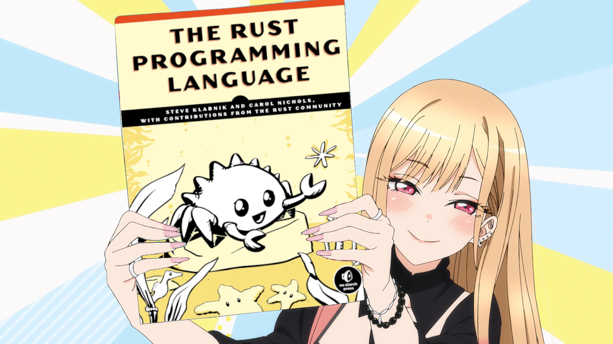

# 러스트 전사

요즘 특히 블록체인쪽에서 인기가 많은 러스트를 배우고 싶다는 주변 의견이 있고,
마침 러스트 프로그래밍을 시작해서 느슨하고 비동기적인 러스트 모임을 만듭니다.
따로 모이지 않고 각자 읽어보고 궁금한 점은 이슈로 이야기 나눌까 합니다.
러스트를 사용하지 않더라도 교양삼아 살펴보면 좋습니다.

* 교재: [공식 문서](https://doc.rust-lang.org/book/)
  ([종이책](https://www.amazon.com/-/en/dp/1718503105/))의
  [한글 번역](https://rust-kr.github.io/doc.rust-kr.org/)
* 놀이터: [Rust Playground](https://play.rust-lang.org/)
* 2월 마지막 주부터 매주 1~2장, 사이사이에 간단한 프로그램 만들기

## 목차

* [시작](openning.md)
* 1\. 시작해봅시다
* 2\. 추리 게임 (2월 27일 시작하는 주)

